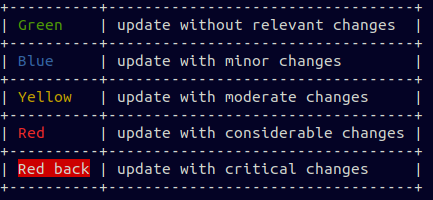

# Go-DSU

[](https://lbesson.mit-license.org/)
[](https://github.com/dpcat237/go-dsu/releases/latest)
[](https://goreportcard.com/report/github.com/dpcat237/go-dsu)
[](https://github.com/dpcat237/go-dsu/workflows/Go%20test/badge.svg)
[](https://codecov.io/gh/dpcat237/go-dsu)
[](https://codebeat.co/projects/github-com-dpcat237-go-dsu-master)

Go DSU (Dependencies Secure Updater) - provides tools to update Go dependencies with more control than default Go tools. 

Now `go-dsu` allows:
- List vulnerabilities and license of direct dependencies and sub dependencies
- Preview available dependencies updates with vulnerabilities and changes in license
- Update dependencies using one of available modes

Vulnerabilities checked from [OSS Index](https://ossindex.sonatype.org/) which uses [CWE](http://cwe.mitre.org/) and [NVD](https://nvd.nist.gov/) databases.

## Installation

    go get github.com/dpcat237/go-dsu

### Requirements

[Go 1.11+](https://golang.org/doc/install), [Git](https://git-scm.com/downloads), and Go modules as dependencies manager.

For private repositories it's required SSH key for Git.

## Usage

```
$ go-dsu
Go DSU - provides tools to update Go dependencies with more control than default Go modules.

Usage:
  go-dsu [command]

Available Commands:
  analyze     Analyze current dependencies
  help        Help about any command
  preview     Preview updates
  update      Update modules
  version     Version

Flags:
  -h, --help   help for go-dsu

Use "go-dsu [command] --help" for more information about a command.
```

### [Usage examples](doc/Examples.md)

#### Legend of changes severity



## Contributing
Go DSU is an open source project and contributions are welcome! Check out the [Issues](https://github.com/dpcat237/go-dsu/issues) or create a new one after reading [Code of Conduct](.github/CODE_OF_CONDUCT.md).
