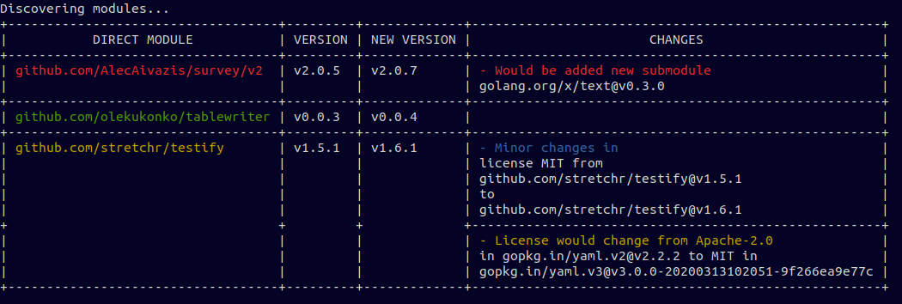

#### WIP - project it's in early stage of development. Use it with caution.

## Overview

Go DSU - provides tools to update Go dependencies with more control than default Go tools.
It works on base of Go modules.

### Implement for first stable version
- [x] Simple update of direct / indirect modules
- [x] Return table with available updates
- [x] Allow select modules to update
- [x] Optionally run local tests before and after update of each module with rollback if tests fail
- [x] Check if license of direct and indirect dependencies changed
- [ ] Create table legend for color in table
- [ ] List license of all dependencies
- [ ] Cover with tests at least all main functions

## Installation

    go get github.com/dpcat237/go-dsu

## Usage

```
$ go-dsu
Go DSU - provides tools to update Go dependencies with more control than default Go modules.

Usage:
  go-dsu [command]

Available Commands:
  clean       Clean modules
  help        Help about any command
  preview     Preview updates
  update      Update modules

Flags:
  -h, --help   help for go-dsu

Use "go-dsu [command] --help" for more information about a command.
```

## Examples

### Preview available updates with changes
`$ go-dsu preview`

