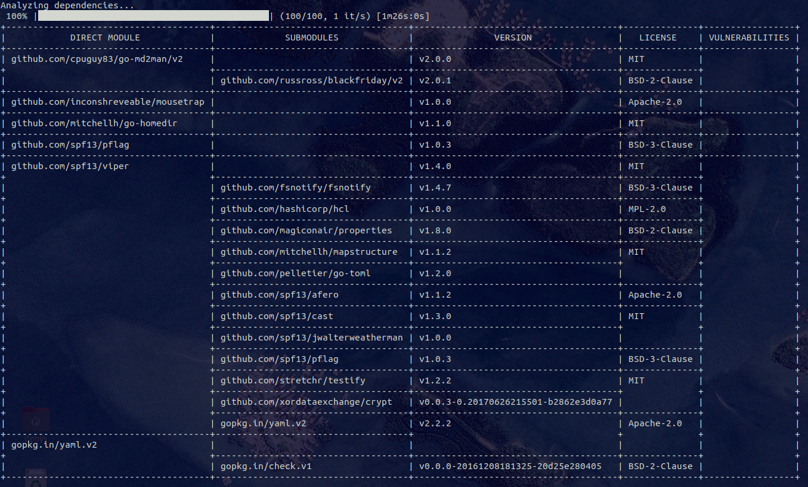

## Examples

### Help

`$ go-dsu help`

### Sub command help

`$ go-dsu help analyze`

#### List vulnerabilities and license of dependencies of a local project
`$ go-dsu analyze`

#### List vulnerabilities and license of dependencies of a remote project

`$ go-dsu analyze --path=github.com/spf13/cobra`

Example output 

#### Preview available updates with changes of a local project

`$ go-dsu preview`

#### Preview available updates with changes of a remote project

`$ go-dsu preview --path=github.com/spf13/cobra`

Example output

#### Update all direct dependencies

`$ go-dsu update`

#### Update all direct dependencies running project's tests after each updated dependency

`$ go-dsu update -t`

#### Update only selected direct dependencies

`$ go-dsu update -s`

#### Update direct dependencies with confirmation for updates with changes. Changes are displayed. 

`$ go-dsu update -p`